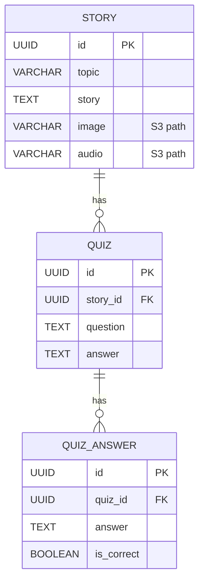
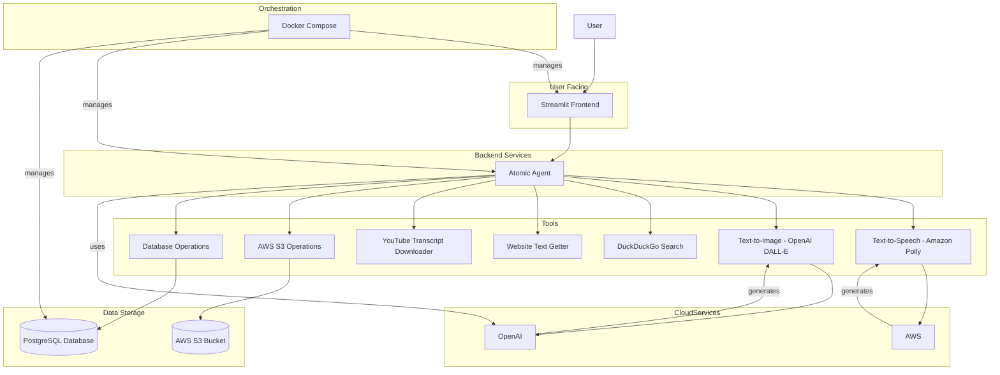

# Final project

## 🎥 DEMO

- **[Technical specification and business use case](https://www.loom.com/share/820b38982a5546fda18083adcd4a518d?sid=578e4fc6-9140-4587-8a29-d18d394fb1cc)** - Overview of the project requirements and implementation

- **[Application demo: easy exercise](https://www.loom.com/share/66d45dd973654942a971cfa8c2ff0b26?sid=7468b108-f1ec-40ed-a989-fff96a0906b3)** - Demonstration of the easy difficulty language exercises

- **[Application demo: medium exercise](https://www.loom.com/share/398320e7f3f94a5c8649b82bb4ce4494?sid=e42f2f14-7daf-4dc4-ab2a-f97fed6e7977)** - Demonstration of medium difficulty exercises with image generation

- **[Application demo: hard exercise](https://www.loom.com/share/c34900615bea4e88b463348b2df99d26?sid=a7fd7bc5-9675-4eee-a4a9-dcd49d991731)** - Demonstration of hard difficulty exercises with audio and quizzes

- **[Bonus! Atomic agents strength: schema validation](https://www.loom.com/share/fb11c20df0d04cada82c45ed2e86373f?sid=8fd803e4-ad7f-4853-b2a2-3bda039c5d35)** - How schema validation helps with agent development

## Prerequisites for running the project locally

- Docker
- Docker compose
- Existing AWS S3 bucket
- AWS credentials
- OpenAI API key

The file `.env` has to be created based on `env.template`. After that the project can be started with `make start`.

The application will be available on `http://localhost:8501`.

## Business use case

- Create an agent which is capable of generating out learning exercises for language learning
- The agent would have a set of tools at its disposal and could decide what sort of exercise to generate
- The agent should be able to generate exercises in a variety of languages. The language used in this case is Italian, but this should be easily changable.
- The agent should be able to generate exercises for a variety of learning styles (e.g. reading, writing, listening)
- The agent should be able to generate exercises which are relevant to the user's current context (e.g. user is a student learning a new subject, the exercise should be about that subject)

## Technical specification

- AI Agent with a list of tools: 
  - Duckduckgo search
  - Website text getter
  - Youtube transcript downloader, structurizer
  - Text to speech converter
  - Text to image converter
  - AWS S3 object ops
  - Database ops
- (stretch goal) Use self hosted solutions for the GenAI tools wherever possible and practical
  - First version should use paid services:
    - Text to speech: Amazon Polly
    - Text to image: OpenAI
    - LLM inference: OpenAI
    - This speeds up development and debugging as the app can be ran locally without the need for powerful servers.
- The UI should be minimal and flexible. It should contain a set of parts which could be used by the agent for the exercise (image view, audio stream, text box, etc.) 
- The agent will act as the orchestrator and as a router between the tasks and the relevant GenAI tools. E.g. it will call the text2image component when image generation is required and the text2speech component when speech generation is required.
- Agent framework: Atomic Agents
- Schema specifications: Pydantic
- Database: Postgres
- File storage: AWS s3
- Frontend: Python Streamlit
- Dockerized with docker-compose for orchestration, with the following components:
  - postgres
  - streamlit frontend + agent backend in one container
- The dependent systems and API keys:
  - AWS
  - OpenAI

### Database schema - REMOVED FROM V1

Story:
- id: uuid
- topic: string
- story: string
- image: string (path to image file on AWS S3)
- audio: string (path to audio file on AWS S3)

Quiz:
- id: uuid
- story_id: uuid (foreign key to Stories)
- question: string
- answer: string

QuizAnswer:
- id: uuid
- quiz_id: uuid (foreign key to Quiz)
- answer: string
- is_correct: bool

### Code structure

- frontend: Streamlit code, main entrypoint to the application
- backend: Python code, agent backend
- tools: Python code, tools for the agent
- database: Python code, database schema and migration utilities
- deploy: deployment scripts
  - docker: Dockerfile for the application and docker-compose
  - iac: terraform code to deploy to AWS
- scripts: shell scripts for the application

### Frontend

The frontend should be flexible and include multiple components which could be used for every exercise type.
It should contain 3 panels:
- One header pannel which contains the input for the exercise: Difficulty (easy, medium, hard), topic (string) and a generate button
- There should be 1 panel after that for easy exercises or 2 panels side-by-side for medium or hard exercises.
- The first panel should be the conversation history and the agent's text output. The first panel should be as wide as the screen in case of the first exercise, or half the width of the screen in case of medium or hard exercises, in that case it should be aligned to the left.
- The second panel should contain the additional learning resources in case of medium or hard exercises, in that case it should be aligned to the right. The additional resources in case of medium exercise: an image view box, in case of a hard exercise: audio streaming box and below that a quiz component.

### Examples of exercises

Each exercise should contain one of the following:
- text
- image
- audio

The agent should prefer to use the available image or audio if it's available for the given topic. Otherwise it should use the available tools to generate out the required resources (image or audio).

Easy difficulty:
- Generate out a random English sentence and ask for the translation in Italian. Evaluate the translation and give feedback.

Medium difficulty:
- Search for a listening exercises about a topic that the user is learning about on youtube. Download the transcript and structure it. After that generate out the listening exercise using text to speech. Lastly generate out a quiz with 5 questions based on the listening exercise. Save the transcript in the database, the text to speech audio on AWS S3 and the quiz in the database.

Hard difficulty:
- Generate a short story about a topic that the user is learning about. The story should be short and concise. Generate an image which encompasses the story. Save the story in the database, the image on AWS S3. Return the image to the user and ask them to describe the image in Italian. Evaluate their description and give them feedback.

### Agent input format

- Topic: string (required)
- Difficulty: string (required)

### Agent final output format

- The agent's output should be a JSON object with the following fields: 
  - exerciseType: string (required)
  - difficulty: string (required)
  - text: string containing the exercise (optional)
  - image: string containing the path in S3 to the image (optional)
  - audio: string containing the path in S3 to the audio (optional)

# Architecture diagram

# Journaling

- The initial scope for the agent was too large and it was difficult the accurately define what the agent should do. Some of the steps were simplified to make it easier to implement
- For some reason the agent didn't want to use the tools that were provided to it. It preferred to hallucinate the outputs instead, so it conforms to the output schema. Forcing the schema to use a field that is the output of one of the agents did not help, as it still preferred to hallucinate instead of using the tool.
- It's crucial to have the tools be small and to test them individually to make sure they are working, so the agent doesn't have issues if it tries to use them
- I (preemptively) added some guardrails so the agent doesn't output the AWS secrets and OpenAI API keys. As the user can send the agent free text, this poses a potential security concern, as the user could input anything they want, and could potentially get the agent to divulge information that it shouldn't.
- As I was making no progress in forcing the agent to use the tools, I turned to using multiple smaller agents. The task needs to be more specific, as otherwise the agent gets lost and starts hallucinating.
- After reducing the agent's scope and splitting it into easy, medium and hard exercise generators, I realized that the agent was still not using any of the defined tools. The reason for this is that I misunderstood the way that the framework works. In a reddit thread the framework developer explained this like so: "Tools and messages are exactly the same in Atomic Agents, it's all Input->Output, the only difference in Atomic Agents is that some times you choose to print or return that output, and some times you decide, using your code, that it is a schema for a tool... I hope that helps debugging, it is kind of a mindset shift that makes you write your code in such a way that makes the code more debuggable step-by-step including tool calls and parameters like you ask" ([source](https://www.reddit.com/r/AtomicAgents/comments/1jnflla/atomic_agents_showcase_song_lyric_to_vocabulary/)). I was expecting the framework to magically take care of calling the tools and chaining them together, but this is not how it works. The framework is made intentionally to be lightweight and simple, so tools calling has to be handled by the code and not by the agent.
- After changing the schemas so that the agent output is a tool input, and then calling the tools via code, it started working. This is the correct way to use the framework, as the agent doesn't need to know about the tools, it only needs to know about the output schema, which can be used for calling the tools.
- Once I got the tool calling right, the rest of the steps were easier. 
- The project is functional but the scope is much smaller than I had intended at the moment (2025.04.12). The following works:
  - Easy exercise: The agent generates an easy exercise. No tools are used. The user can respond and the agent evaluates the response
  - Medium exercise: The agent comes up with an exercise that requires an image. The agent generates the prompt for the image generator. The image generator is used (OpenAI) and then the image is also uploaded to S3
  - Hard exercise: The agent comes up with an exercise that requires audio and can be evaluated using a quiz. The agent generates a situation based on the topic and this is fed into the Audio generator. The audio generator is used (Amazon Polly) and then the audio is also uploaded to S3
- I tried to split the UI into smaller manageable pieces, but the code is still hard to understand. It will need further refactoring.
- Demo video will come soon!