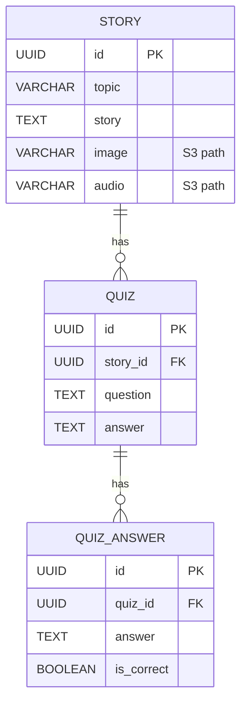
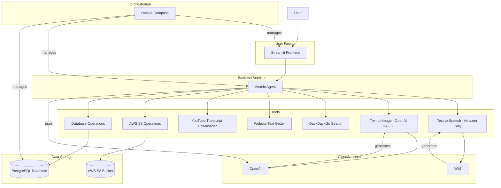

# Final project

## Business use case

- Create an agent which is capable of generating out learning exercises for language learning
- The agent would have a set of tools at its disposal and could decide what sort of exercise to generate
- The agent should be able to generate exercises in a variety of languages. The language used in this case is Italian, but this should be easily changable.
- The agent should be able to generate exercises for a variety of learning styles (e.g. reading, writing, listening)
- The agent should be able to generate exercises which are relevant to the user's current context (e.g. user is a student learning a new subject, the exercise should be about that subject)

## Technical specification

- AI Agent with a list of tools: 
  - Duckduckgo search
  - Website text getter
  - Youtube transcript downloader, structurizer
  - Text to speech converter
  - Text to image converter
  - AWS S3 object ops
  - Database ops
- (stretch goal) Use self hosted solutions for the GenAI tools wherever possible and practical
  - First version should use paid services:
    - Text to speech: Amazon Polly
    - Text to image: OpenAI
    - LLM inference: OpenAI
    - This speeds up development and debugging as the app can be ran locally without the need for powerful servers.
- The UI should be minimal and flexible. It should contain a set of parts which could be used by the agent for the exercise (image view, audio stream, text box, etc.) 
- The agent will act as the orchestrator and as a router between the tasks and the relevant GenAI tools. E.g. it will call the text2image component when image generation is required and the text2speech component when speech generation is required.
- Agent framework: Atomic Agents
- Schema specifications: Pydantic
- Database: Postgres
- File storage: AWS s3
- Frontend: Python Streamlit
- Dockerized with docker-compose for orchestration, with the following components:
  - postgres
  - streamlit frontend + agent backend in one container
- The dependent systems and API keys:
  - AWS
  - OpenAI

### Database schema

Story:
- id: uuid
- topic: string
- story: string
- image: string (path to image file on AWS S3)
- audio: string (path to audio file on AWS S3)

Quiz:
- id: uuid
- story_id: uuid (foreign key to Stories)
- question: string
- answer: string

QuizAnswer:
- id: uuid
- quiz_id: uuid (foreign key to Quiz)
- answer: string
- is_correct: bool

### Code structure

- frontend: Streamlit code, main entrypoint to the application
- backend: Python code, agent backend
- tools: Python code, tools for the agent
- database: Python code, database schema and migration utilities
- deploy: deployment scripts
  - docker: Dockerfile for the application and docker-compose
  - iac: terraform code to deploy to AWS
- scripts: shell scripts for the application

### Examples of exercises

Each exercise should contain one of the following:
- text
- image
- audio

The agent should prefer to use the available image or audio if it's available for the given topic. Otherwise it should use the available tools to generate out the required resources (image or audio).

Easy difficulty:
- Generate out a random English sentence and ask for the translation in Italian. Evaluate the translation and give feedback.

Medium difficulty:
- Search for a listening exercises about a topic that the user is learning about on youtube. Download the transcript and structure it. After that generate out the listening exercise using text to speech. Lastly generate out a quiz with 5 questions based on the listening exercise. Save the transcript in the database, the text to speech audio on AWS S3 and the quiz in the database.

Hard difficulty:
- Generate a short story about a topic that the user is learning about. The story should be short and concise. Generate an image which encompasses the story. Save the story in the database, the image on AWS S3. Return the image to the user and ask them to describe the image in Italian. Evaluate their description and give them feedback.

### Agent input format

- Topic: string (required)
- Difficulty: string (required)

### Agent final output format

- The agent's output should be a JSON object with the following fields: 
  - exerciseType: string (required)
  - difficulty: string (required)
  - text: string containing the exercise (optional)
  - image: string containing the path in S3 to the image (optional)
  - audio: string containing the path in S3 to the audio (optional)

# Architecture diagram

