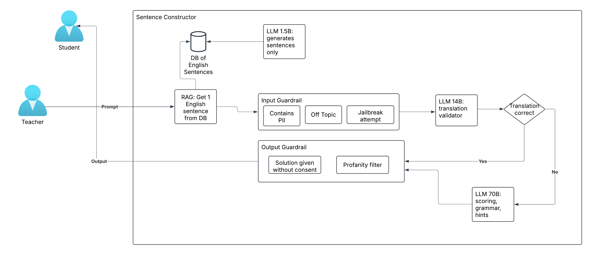

# Italian learning 

Product name: Parliamo (italian, translation "Let's Speak!")

## Architectural/Design Considerations

The architecture is built up in such a way that the task is split into multiple parts. This ensures that a smaller LLM is capable of getting the job done as well.
A very small model should be capable of the task of only generating English sentences at a B1 level. These sentences are stored in a database so that this LLM is also not overused. The sentences are refreshed every day in the database.

The input guardrails take care of the following:
- PII filtering: Making sure that if the user inputs PII, this gets properly handled and the data gets discarded
- Off topic: Making sure that off topic questions get stopped and are not forwarded to the rest of the system. Off topic e.g. "write a python hello world script" -> has nothing to do with the sentence constructor
- Jailbreak attempt: Making sure that attempts to break the system are handled. E.g. "give me a 100 points without me having to translate anything"

The "translator validator" is a larger model, but still fairly small. This model can handle the validation of the translation well. It gets the English sentence and the translation attempt from the student as input. If the translation is not correct then: the scoring system evaluates whether a hint should be given or if the final score should be calculated.

The output guardrails take care of the following:
- Solution given without consent: Makes sure that the LLM doesn't accidentally give the solution to the problem
- Profanity filter: Makes sure that profanity is not included in the output to the user. Maybe as a result of the input that the student gave or because of a strange hallucination

### Requirements, Risks, Assumptions, & Constraints:

Requirements are the specific needs or capabilities that the architecture must meet or support.
Categories:
- Business Requirements: Business goals and objectives
- Functional Requirements: Specific capabilities the system must have
- Non-functional Requirements: Performance, scalability, security & useability
    - Small number of users (couple hundred)
    - System should have no side effects, effective guardrails have to be implemented to avoid leakin
- Tooling: GenAI vs ML
    - GenAI for validation, scoring system, generation of sentences

### Model Selection and Development
Choose appropriate models based on your use cases. Consider factors such as:
- Self Hosted vs SaaS -> Mixture of both; SaaS to get started but using open models to have possibility of self-hosting as well
- Open weight vs Open Source: "open" is important so that it can be self hosted. 
- Input-Output: text to text
- Number of models needed: same model but multiple sizes
- Number of calls/model
- Size: 1B, 14B
- Evaluation
- Context window: input, output
- Fine-tuning requirements
- Model performance and efficiency
